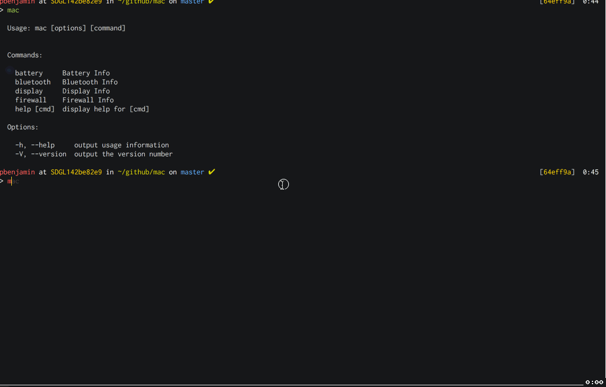

# mac-os
The CLI for MacOS written in JavaScript

Inspided by the [m-cli](https://github.com/rgcr/m-cli) project.

**DISCLAIMER:** Package is still under heavy development. Features may change without notice.

## Install
`npm install -g mac-os`

## Demo


## Usage
```
$ mac

  Usage: mac [options] [command]


  Commands:

    battery     Battery Info
    bluetooth   Bluetooth Info
    display     Display Info
    firewall    Firewall Info
    help [cmd]  display help for [cmd]

  Options:

    -h, --help     output usage information
    -V, --version  output the version number
```

## TODO
Add support for:
  - [ ] Disk
  - [ ] DNS
  - [ ] Dock
  - [ ] Finder
  - [ ] Add/Remove Firewall 
  - [ ] Gatekeeper
  - [ ] Group
  - [ ] Hostname
  - [ ] Machine Info
  - [ ] Lock
  - [ ] Network
  - [ ] Caffeinate
  - [ ] Notification
  - [ ] NTP
  - [ ] Restart
  - [ ] Safeboot
  - [ ] Screencapture
  - [ ] Screensaver
  - [ ] Shutdown
  - [ ] Sleep
  - [ ] Timezone
  - [ ] Trash
  - [ ] Update
  - [ ] User
  - [ ] Volume
  - [ ] VPN
  - [ ] WiFi